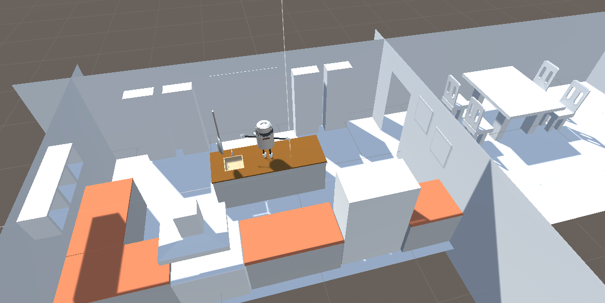

# vr-trial-june-2019

## Summary

The main intention of this project was to develop a VR game within 3 days. 

- Because my major background is programming, I wanted to improve my skills as a modeller, an animator as well as a project manager.
- But the project should also serve as a proof of concept for future contracts.

### Topics

- Oculus Rift including Touch Controllers
- Humanoid coffee mugs

## Details

- Project start was in the evening of the 7th june
- Main development happend from the 8th to the 10th june
- The project documentation was made in the evening of the 11th june

## Goals

- The player's goal is to stay on top of the kitchen table

## Rules

- The player wins, if all enemies are beaten
- The player looses, if he falls of the kitchen table

## Controls

- Use the start button of the left Oculus Touch Controller to navigate between menues
- Use the IndexTriggers of the left/right Oculus Touch Controllers to shoot

## Missing Features / Changes During The Development

- Post Processing
- Enemies cannot attack player, but push him/her off the table
- Enemies cannot (re-)spawn
- Enemies cannot walk on the kitchen floor
- Player cannot teleport
- Player cannot push/pull enemies, but instead can shoot two weapons
- No sound effects except for shooting
- No complex baked lighting, because of technical difficulties

## Dependencies / Other Packages

- Oculus (Desktop) 1.36.0
- Further details: [manifest.json](https://github.com/lars-wobus/vr-trial-june-2019/blob/master/Oculus%20Rift%20Project/Packages/manifest.json)

## Image Gallery

Splashscreen               |  Winning Screen           |  Loosing Screen
:-------------------------:|:-------------------------:|:-------------------------:
 |   |  

NPC 1 (coffee mug)    | NPC 2 (milk churn)     | NPC 3 (sugar cube)
:-------------------------:|:-------------------------:|:-------------------------:
 |  | 

Early state of the main level | Out of bounds perspective | Experiementing with weapons in VR
:-------------------------:|:-------------------------:|:-------------------------:
 |  | 

Final level from a third person perspective | Final level from another third person perspective
:-------------------------:|:-------------------------:
 | 
